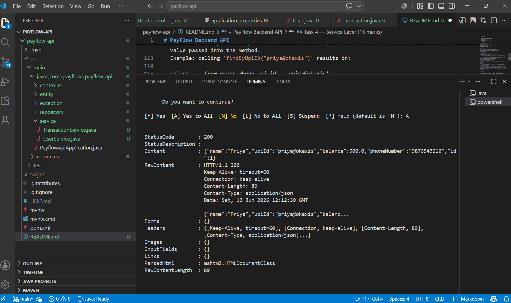
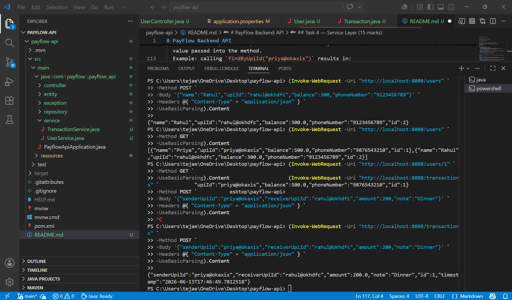

# PayFlow Backend API

PayFlow is a simplified fintech backend inspired by systems like PhonePe or Google Pay.  
It allows registering users, assigning wallet balances, and recording money transfers — all via REST APIs.

---

##  Project Setup

##  How to Run the App

1. Clone or download the project.
2. Navigate into the project folder.
3. Run with Maven:

   mvn spring-boot:run

4. The app starts on **http://localhost:8080** using Spring Boot’s embedded Tomcat server.
5. Access the H2 console at **http://localhost:8080/h2-console**  
   - JDBC URL: `jdbc:h2:file:./data/payflowdb` (or `jdbc:h2:mem:testdb` if using in-memory)  
   - Username: `sa`  
   - Password: (blank password due to in memory db)


##  Project Structure

Organized into four packages:

- **entity**  
  Contains JPA entity classes (`User`, `Transaction`). These map Java fields to database columns.

- **repository**  
  Interfaces extending `JpaRepository`. Provide CRUD operations and derived queries like `findByUpiId`.

- **service**  
  Business logic layer. Handles registering users, fetching users, and sending money transactions.

- **controller**  
  REST endpoints (`/users`, `/transactions`). Expose APIs for frontend or external clients.

---

##  Spring Boot Features in PayFlow

- **Embedded Server**  
  No need to deploy to Tomcat manually. Running `mvn spring-boot:run` starts an embedded Tomcat server on port 8080.

- **Auto-Configuration**  
  Spring Boot automatically configures JPA, H2, and REST controllers. No XML or manual setup required.

- **Production-Ready Defaults**  
  - Default error handling (`404`, `500` responses in JSON).  
  - Logging of Hibernate SQL queries (`spring.jpa.show-sql=true`).  
  - H2 console enabled for quick DB inspection.  
  - Ready to swap H2 for MySQL/Postgres with minimal config changes.


##  Entities & Database 

### Auto-Generated Tables

On first startup, Hibernate automatically created the tables for `User` and `Transaction`.  
Below are the exact `CREATE TABLE` statements from the console:

Hibernate: create table transaction (
    id bigint generated by default as identity,
    amount float(53),
    note varchar(255),
    receiver_upi_id varchar(255),
    sender_upi_id varchar(255),
    timestamp timestamp(6),
    primary key (id)
)

Hibernate: create table users (
    id bigint generated by default as identity,
    balance float(53),
    name varchar(255),
    phone_number varchar(255),
    upi_id varchar(255),
    primary key (id)
)


## 📝 Task 5 — Controller & REST Endpoints




### With @RequestBody
When calling `POST /users` with `@RequestBody` in the controller method:


@PostMapping("/users")
public User registerUser(@RequestBody User user) {
    System.out.println(user);
    return userRepository.save(user);
}


**Curl Request:**

curl -X POST http://localhost:8080/users \
-H "Content-Type: application/json" \
-d '{"name":"Priya","upiId":"priya@okaxis","balance":500,"phoneNumber":"9876543210"}'


**Controller Output (println):**

User{id=0, name='Priya', upiId='priya@okaxis', balance=500.0, phoneNumber='9876543210'}


### Without @RequestBody
If you remove `@RequestBody`:

@PostMapping("/users")
public User registerUser(User user) {
    System.out.println(user);
    return userRepository.save(user);
}

**Curl Request (same as above):**

curl -X POST http://localhost:8080/users \
-H "Content-Type: application/json" \
-d '{"name":"Priya","upiId":"priya@okaxis","balance":500,"phoneNumber":"9876543210"}'

**Controller Output (println):**

User{id=0, name='null', upiId='null', balance=null, phoneNumber='null'}

---

### Explanation
Without `@RequestBody`, Spring does not know how to bind the JSON payload to the `User` object. It only looks for form parameters or query string values, so the object is created but all fields remain `null`. Adding `@RequestBody` tells Spring to use **Jackson** to deserialize the incoming JSON into a Java object, ensuring the fields are populated correctly.


## 🔍 Task 6 — Custom Query 

We implemented two custom queries in addition to the derived method:

1. **Derived Method Name**  
   - `findByUpiId(String upiId)`  
   - Exposed via `GET /users/upi/{upiId}` to return the user matching a given UPI ID.  
   - JPA automatically parses the method name and generates the SQL.

2. **@Query with JPQL**  
   - `@Query("SELECT u FROM User u WHERE u.balance > :amount")`  
   - `findUsersWithBalanceAbove(double amount)`  
   - This uses JPQL, which is object‑oriented and works with entity fields rather than table columns.

3. **Native SQL (for comparison)**  
   - `@Query(value = "SELECT * FROM users WHERE balance > ?1", nativeQuery = true)`  
   - Directly executes database‑specific SQL.

### Comparison
- **Derived method names** are concise and ideal for simple queries. They rely on Spring Data JPA’s naming conventions to generate SQL automatically.  
- **JPQL with @Query** offers flexibility for more complex queries while remaining database‑agnostic, since JPQL operates on entities rather than raw tables.  
- **Native SQL** is the least preferred because it ties the application to a specific database dialect, reduces portability, and bypasses JPA’s abstraction layer. It should only be used when JPQL cannot express the query or for performance‑critical cases.

✅ This demonstrates three approaches to custom queries and explains why native queries are discouraged in favor of derived methods or JPQL.

## 🧠 Task 6.4 — Conceptual Write‑Up 

### 1. Request Lifecycle
When `curl` sends `POST /users`, the request first hits the **DispatcherServlet**, which is the central front controller in Spring MVC. The DispatcherServlet looks up the appropriate handler mapping and delegates to a **HandlerAdapter** that knows how to invoke controller methods. The `createUser` method in `UserController` is then called with the deserialized `User` object. Finally, the response is built and returned as JSON.

### 2. Serialization
When you POST JSON like `{"name":"Priya","upiId":"priya@okaxis"}`, Spring Boot uses **Jackson** to convert the JSON into a Java `User` object. Jackson matches JSON keys to Java field names. If the JSON key is `"upi_id"` instead of `"upiId"`, the field will not map correctly and will remain `null` unless you add an annotation like `@JsonProperty("upi_id")`.

### 3. Spring Boot Features
Spring Boot provides three key features: **Embedded Server**, **Auto‑Configuration**, and **Production‑Ready Defaults**. In PayFlow, the embedded Tomcat server runs automatically when you use `mvn spring-boot:run`. Auto‑configuration sets up JPA, H2, and REST controllers without XML. Production‑ready defaults give you JSON error responses, SQL logging, and the H2 console enabled out of the box.

### 4. Spring vs. Spring Boot
With plain Spring, you would have to manually configure the servlet container, set up JPA and Hibernate, and write XML or Java config for controllers and data sources. Spring Boot takes care of these automatically through auto‑configuration and sensible defaults. This saves time and reduces boilerplate, letting you focus on writing business logic instead of wiring infrastructure.

### 5. Stateless REST
Stateless means each request is independent and does not rely on previous requests. For example, `POST /transactions` does not remember any prior transaction — it only processes the JSON payload sent with that request. This matters when PayFlow runs on multiple servers behind a load balancer, because any server can handle any request without needing shared session state.

### 6. Persistence
By storing transactions in the H2 database, the records survive server restarts. If you had used a Java `List`, all transaction data would be lost when the application stopped, because memory is cleared. For a payments app, this is unacceptable — persistence ensures financial records are durable, reliable, and consistent across sessions.


##  Postman Testing

All endpoints can be tested using **Postman**:

1. **Register User**  
   - Method: POST  
   - URL: `http://localhost:8080/users`  
   - Body → Raw → JSON:
     ```json
     {
       "name": "Priya Sharma",
       "upiId": "priya@okaxis",
       "balance": 5000,
       "phoneNumber": "9876543210"
     }
     ```

2. **List All Users**  
   - Method: GET  
   - URL: `http://localhost:8080/users`

3. **Get User by ID**  
   - Method: GET  
   - URL: `http://localhost:8080/users/1`

4. **Get User by UPI ID**  
   - Method: GET  
   - URL: `http://localhost:8080/users/upi/priya@okaxis`

5. **Send Money**  
   - Method: POST  
   - URL: `http://localhost:8080/transactions`  
   - Body → Raw → JSON:
     ```json
     {
       "senderUpiId": "priya@okaxis",
       "receiverUpiId": "rahul@okhdfc",
       "amount": 200,
       "note": "Dinner split"
     }
     ```

6. **List All Transactions**  
   - Method: GET  
   - URL: `http://localhost:8080/transactions`

---

## Notes

- Data persists across runs if using **file-based H2** (`jdbc:h2:file:./data/payflowdb`).  
- In-memory H2 (`jdbc:h2:mem:testdb`) resets on restart.  
- Transactions store sender/receiver UPI IDs as plain strings (no foreign keys yet).  
- `@RequestBody` is required in controllers to bind JSON payloads to Java objects.
```
